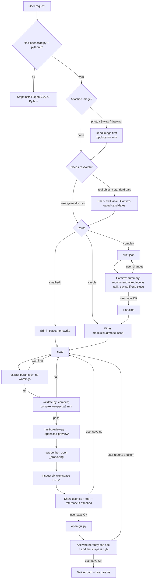

# OpenSCAD Customizer

> Human guide. Runtime instructions: [skills/openscad-customizer/SKILL.md](../skills/openscad-customizer/SKILL.md).

Write and **verify** parametric OpenSCAD for the **desktop app**. Default output is `models/<slug>/model.scad`. This skill does not upload models and does not write `info.json`, covers, `README.md`, or `packages/`. For [vary3d.com](https://vary3d.com) Import from folder, use [vary3d-package](vary3d-package.md) after you have a working `.scad`.

Install:

```bash
npx skills add vary3d/skills@openscad-customizer
```

## What it is for

| Use this skill | Not this skill |
|---|---|
| “Design an M5 flange” | “Pack this flange for Vary3D import” → vary3d-package |
| Parametric `.scad` + Customizer sliders | `info.json`, `variants.json`, cover PNGs, package `README.md` |
| Compile, bbox, six views, open GUI | Publish or review on the site |

Requires **OpenSCAD CLI** and **Python 3** (macOS, Linux, native Windows — no WSL).

## Core idea

**Compile passing is not done. User confirmation is required. Research comes first.**

1. **Research** — millimetres from the user, in-skill tables, or Confirm-gated candidates (do not guess). If they attached a photo or drawing, **read it first**: topology from the image, millimetres from text / table / a question ([reference-image.md](../skills/openscad-customizer/references/reference-image.md)).
2. **Route** the request (simple / complex / small-edit).
3. **Write** Customizer OpenSCAD (complex: `brief.json` + `plan.json` first).
4. **Confirm** with the user at key checkpoints (design intent, **image reading** when they attached a reference, shape, delivery).
5. **Verify** with machine checks, not gut feel.
6. **Hand off** by opening the desktop app (`open-gui.py`) and asking in the user’s language whether they can see it and whether the shape looks right.

Design rules that matter most:

- **Research before Brief** — parts mating to real objects or using standard parts (bearing, bolt, keycap) need real millimetres: user text, in-skill tables, or Confirm-gated candidates. Cite `sources` in `brief.json`. A product photo is not a millimetre source.
- **Few knobs, derived rest** — millimetres in the request are defaults, not sliders. Visible cap: simple ≤ 6, complex ≤ 8. Mate holder: object sizes only; stand derived. `extract-params.py` must be warning-free **before six views** (and before Done).
- **Files default to English**; chat follows the user’s language.
- **Prefer no third-party library** so the GUI opens the file as-is. Inline MIT examples for gears, trapezoid threads, polyhole, teardrop, self-tap (do not `use <MCAD>`).
- **Print: reorient, then geometry, then split, then supports.** User saying “split” is Confirm, not auto-split. If it stays one piece, **say so** (wall angle / bed face). 2–4 printable kinds of **one article** → one `part` enum, default All; `part` is the **first** top-level assignment (before Dimensions and color) so the part selector leads the panel; tokens share envelope + `wall` (no `base_l` + `lid_l`). Extra `.scad` roots only for a second product. Split joints: derive from host wall thickness; open an assembled section through the joint ([print.md](../skills/openscad-customizer/references/print.md)).
- **User is the judge of design intent** — the agent can spot broken geometry, but only the user knows if the shape matches what they wanted (or their photo / drawing).

## Workflow



### Routing

| Type | Examples | Brief / Plan |
|---|---|---|
| **Small-edit** | Change a default angle | None — edit in place |
| **Simple** | Flange, washer, cup, one plate + holes | In head only; no JSON files |
| **Complex** | Multi-body, kinematics, print-in-place, **split after Confirm**, unclear layout, **product photo / undimensioned drawing** | `brief.json` + `plan.json` required |

### Six gates

| Stage | Simple | Complex |
|---|---|---|
| 0.5 **Research** | Skip if user gave all sizes | **Sizes from user, in-skill table, or Confirm-gated candidates** |
| 1 Brief | In your head | `brief.json` (bbox, MUST features, sources) |
| 1.5 **Confirm** | Skip unless they mentioned split / supports: one-piece vs split | **Show summary to user, wait for OK** |
| 2 Plan | Skip | `plan.json` (CSG steps) |
| 3 SCAD | Same style rules | Same style rules |
| 4 Verify | Compile; six views; **check floating parts**; show user iso+top (**and the reference** if they attached one) | Compile + bbox ±1 mm on the **default file**. If `part` exists: bbox is `all`; **skip** `--single-body` on `all`; **single-body per printable token**. One-piece complex: `--single-body` on the default file. Print-in-place: skip `--single-body`. Six views; show user iso+top (**and the reference** if they attached one) |

**Research is a gate, not a shortcut.** Mating parts need real millimetres (user text, in-skill table, or Confirm-gated candidates). Cite `sources` in `brief.json` when a number did not come from the user. A photo is not a millimetre source.

**Confirm is a gate, not a courtesy.** On complex, do not write SCAD until the user says the brief is right. If they attached a reference, Confirm includes what you read from the image. If print strategy is in play, ask one-piece vs split with a recommendation and wait — say **one piece, no split** when that is the answer. A split decided after six views: update the brief, re-Confirm, then rewrite plan and SCAD — do not patch `part` in place. On simple, show six views and ask in the user’s language whether the shape looks right before Done; delivery still states one piece. With a reference image, show iso + top **and** that image and ask whether it matches.

### Verification

`SKILL_ROOT` is the skill folder (the directory that contains `SKILL.md`). Confirm the CLI first:

```bash
python3 "$SKILL_ROOT/scripts/find-openscad.py"
```

**Agent gate before six views** — `extract-params.py` must print **no `warnings`** (count ceilings, deny-list names, file-scope formulas). Not a compile fail; `validate.py` still exits 0.

```bash
python3 "$SKILL_ROOT/scripts/extract-params.py" path/to/model.scad
```

**Hard gate** — compile always. **`--expect` is for complex** (assembled bbox on the default file if `part="all"`), or simple when the user gave a size. Exit 0 pass / 1 compile fail / 2 bbox miss / 3 multi-body (`--single-body` only).

```bash
python3 "$SKILL_ROOT/scripts/validate.py" path/to/model.scad
python3 "$SKILL_ROOT/scripts/validate.py" path/to/model.scad --expect 80 80 5 --tol 1

# One-piece: --single-body on the default file. Print-in-place: skip.
# Split: skip --single-body on all; one run per printable token:
python3 "$SKILL_ROOT/scripts/validate.py" path/to/model.scad --single-body \
  --openscad-arg=-D --openscad-arg='part="lid"'
```

**Soft gate** — when the CLI can render. Output must be **inside the workspace** (default `.openscad-preview/` beside the `.scad`). Many agent image viewers reject `/tmp` paths even for valid PNGs.

```bash
python3 "$SKILL_ROOT/scripts/multi-preview.py" --probe path/to/model.scad
# → .openscad-preview/_probe.png

python3 "$SKILL_ROOT/scripts/multi-preview.py" path/to/model.scad
# → .openscad-preview/model-{iso,front,...}.png
# Split token iso (print pose). Do not change the file default; pass -D:
python3 "$SKILL_ROOT/scripts/preview.py" path/to/model.scad \
  .openscad-preview/lid-iso.png iso --openscad-arg=-D --openscad-arg='part="lid"'
```

Cavities, walls, and lid joints: `section.py --plane xz --2d` (2D is the default). Split: assembled section through the joint is a gate. Do not judge those from a `--3d` iso cutaway — it shows the remaining outer shell. If opening a PNG fails, first check the path is workspace-relative, not `/tmp`. Only then use fallback: `section.py --2d` + `outline.py`. See [references/verify.md](../skills/openscad-customizer/references/verify.md).

If this session changed geometry ≥2 times (or complex already rendered), snapshot and compare to the previous PNGs:

```bash
python3 "$SKILL_ROOT/scripts/snapshot.py" path/to/model.scad --reason "fix hole offset" \
  .openscad-preview/model-iso.png .openscad-preview/model-top.png
```

**Handoff** — default after Done-when:

```bash
python3 "$SKILL_ROOT/scripts/open-gui.py" path/to/model.scad
```

Tell the user: F5 preview, Window → Customizer for sliders. **Ask in the user’s language** whether they can see it and whether the shape looks right. Do not mark Done until they say OK.

## Typical output

```text
models/<slug>/
  model.scad                   # entry (user path wins if they named one)
  brief.json                   # complex only
  plan.json                    # complex only
  .openscad-preview/           # six views + probe; workspace-only; not for git
  .openscad-iter/001/          # optional iteration snapshots; not for git
```

Do not write `packages/`, `info.json`, or covers — that is [vary3d-package](vary3d-package.md). One-piece: say so in the reply; no `part` enum. Split models add a `part` enum (default All); still one `model.scad`. Do not write `params.scad` unless complementary pieces live on different files (opening A cannot export B).

## Further reading

| Topic | File |
|---|---|
| Runtime entry | [SKILL.md](../skills/openscad-customizer/SKILL.md) |
| Brief / Plan | [references/brief-plan.md](../skills/openscad-customizer/references/brief-plan.md) |
| Reference images (user input) | [references/reference-image.md](../skills/openscad-customizer/references/reference-image.md) |
| SCAD style | [references/scad-style.md](../skills/openscad-customizer/references/scad-style.md) |
| Verify + fallback | [references/verify.md](../skills/openscad-customizer/references/verify.md) |
| Print strategy + FDM | [references/print.md](../skills/openscad-customizer/references/print.md) |
| Spur gears (inline MIT) | [references/spur-gear.md](../skills/openscad-customizer/references/spur-gear.md) |
| Trapezoid threads (inline MIT) | [references/trap-thread.md](../skills/openscad-customizer/references/trap-thread.md) |
| Vertical / horizontal / self-tap holes | [polyhole.md](../skills/openscad-customizer/references/polyhole.md), [teardrop.md](../skills/openscad-customizer/references/teardrop.md), [selftap.md](../skills/openscad-customizer/references/selftap.md) |
| Examples | [examples.md](../skills/openscad-customizer/examples.md) |
| Vary3D publish format | [vary3d/spec](https://github.com/vary3d/spec) |
