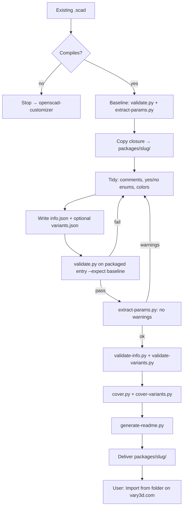

# Vary3D model package

> Human guide. Runtime instructions: [skills/vary3d-package/SKILL.md](../skills/vary3d-package/SKILL.md).

Turn an **existing** Customizer `.scad` into a folder that [vary3d.com](https://vary3d.com) **Import from folder** can map into a draft. This skill **does not invent geometry** and **does not upload**. If there is no working `.scad` yet, use [openscad-customizer](openscad-customizer.md) first.

Install:

```bash
npx skills add vary3d/skills@vary3d-package
```

## What it is for

| Use this skill | Not this skill |
|---|---|
| Wrap `.scad` → `packages/<slug>/` + `info.json` | Design a part from scratch → openscad-customizer |
| Covers, presets, fork attribution | Upload or publish (user does that on the site) |
| Normalize comments / enums for the site panel | Change outside shape (>1 mm bbox or ~5% volume) |

Requires **OpenSCAD CLI** and **Python 3** (same as openscad-customizer).

Runtime authority: [references/package.md](../skills/vary3d-package/references/package.md) and [examples/m5-flange/](../skills/vary3d-package/examples/m5-flange/). Human spec docs: [vary3d/spec](https://github.com/vary3d/spec) — do not fetch that at runtime; copy deltas into `package.md` and bump the skill.

## Core idea

**Packaging is not redesign.** Copy the source tree, tidy metadata, prove the mesh is unchanged, then add listing files.

1. **Baseline** the source (bbox, volume, params).
2. **Copy** the include/use closure into `packages/<slug>/` (do not edit `models/` unless the user asked in-place).
3. **Tidy** Customizer copy without moving geometry (enums, `_color`, snake_case renames with preset key updates; if a `part` enum exists, move it to the first top-level assignment).
4. **Validate** shape + knobs + JSON, then covers.
5. **Deliver** the folder path; user imports on vary3d.com.

Design rules that matter most:

- **Shape unchanged** — packaged `model.scad` must match source bbox within **±1 mm** (`validate.py --expect … --tol 1`). Compare `volume_mm3` from the two JSON outputs by eye (~**5%**); that is not a `validate.py` flag.
- **Few knobs** — `extract-params.py` lists only intended knobs and prints **no `warnings`**.
- **Keep existing slider labels** — do not rewrite local-language labels to English; the site translates after publish. New copy defaults to English unless the user asked otherwise.
- **Description leads** — cards show the first sentence or two; put object + mate/feature first. More sentences are allowed (≤800).
- **Tags are search axes** — about 3, max 5: object, mate, distinctive feature; scene only if the object name is generic. Do not pad.
- **Never invent `parentModelId`** or other server fields.
- **STL-only entry is rejected** — need OpenSCAD source.
- **Do not invent a split** — if the source has a `part` enum, keep it; README `## Print` lists Print N× per token. Do not add `variants.json` presets that only switch `part`.

## Workflow



### Output layout

```text
packages/<slug>/
  model.scad          # entry (required)
  info.json           # listing seed (required to publish)
  cover.png           # 4:3 from cover.py
  variants.json       # when ≥2 useful presets
  covers/<preset>.png
  params.scad         # kit only: complementary pieces on different files
  README.md           # Long-form; GitHub + Import → Docs
  LICENSE             # forks: upstream text, unmodified
  ORIGIN.md           # forks: Forked from, what changed
```

Do **not** ship `.openscad-iter/`, `.openscad-preview/`, `.vary3d-iter/`, `brief.json`, `plan.json`, cached STL, or `.DS_Store`. Extra `.scad` pulled in by `use` / `include` stays in the bundle.

### Shape check

`SKILL_ROOT` is the skill folder (the directory that contains `SKILL.md`). `--expect X Y Z` is `size` from the source JSON. Compare `volume_mm3` yourself (~5%).

```bash
# Source
python3 "$SKILL_ROOT/scripts/validate.py" path/to/original.scad

# Packaged — same size ±1 mm
python3 "$SKILL_ROOT/scripts/validate.py" packages/<slug>/model.scad --expect X Y Z --tol 1

# Top-level knobs — no warnings before Done
python3 "$SKILL_ROOT/scripts/extract-params.py" packages/<slug>/model.scad
```

### Listing and covers

`validate-info.py` does not require `cover` (covers are rendered after). Add `cover.png` before the user publishes.

```bash
python3 "$SKILL_ROOT/scripts/validate-info.py" packages/<slug>/info.json
python3 "$SKILL_ROOT/scripts/validate-variants.py" packages/<slug>/variants.json   # if presets
python3 "$SKILL_ROOT/scripts/cover.py" packages/<slug>/model.scad
python3 "$SKILL_ROOT/scripts/cover-variants.py" packages/<slug>/variants.json
python3 "$SKILL_ROOT/scripts/generate-readme.py" packages/<slug>
```

Preset covers use OpenSCAD `-D` on the preview entry so Global keys in `params.scad` apply. First cover render may install a **Vary3D** color scheme locally so uncolored faces match the site (`#2A9D90`). Open `cover.png`. If there are many preset covers, open at least the default plus the two that change the silhouette most. `README.md` is GitHub and Import Documentation. `validate-info.py` does not require README.

Printable parts: `## Print` in the README (settings, orientation, why). Split models: include Print N× per `part` token; `all` is preview only; no preset per token. See [references/print.md](../skills/vary3d-package/references/print.md).

Forks: keep upstream `LICENSE`; write `ORIGIN.md`; fill source fields. Original tree `git status` stays clean unless the user asked in-place.

## Two skills together

```text
User: "Design an M5 flange"
  → openscad-customizer → models/m5-flange/model.scad

User: "Make it importable on Vary3D with M4/M5 presets"
  → vary3d-package → packages/m5-flange/
  → user imports on vary3d.com
```

## Further reading

| Topic | File |
|---|---|
| Runtime entry | [SKILL.md](../skills/vary3d-package/SKILL.md) |
| Copy without shape change | [references/normalize.md](../skills/vary3d-package/references/normalize.md) |
| info.json, covers, README, ORIGIN | [references/package.md](../skills/vary3d-package/references/package.md) |
| Print in README `## Print` | [references/print.md](../skills/vary3d-package/references/print.md) |
| Examples | [examples.md](../skills/vary3d-package/examples.md) |
| Publish spec | [vary3d/spec](https://github.com/vary3d/spec) |
